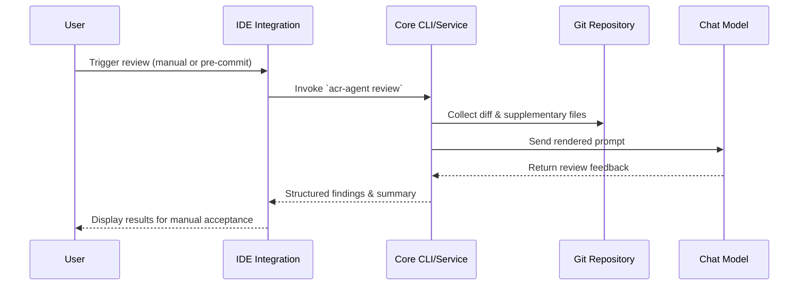
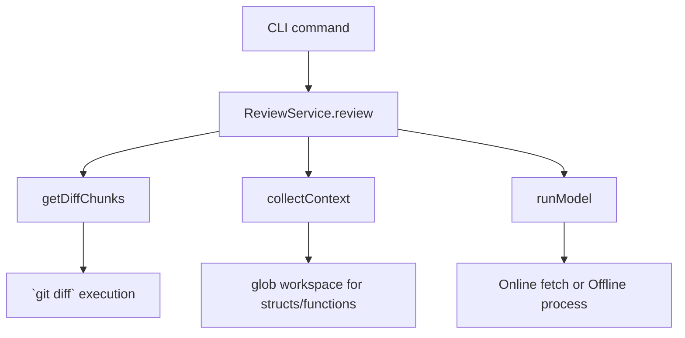
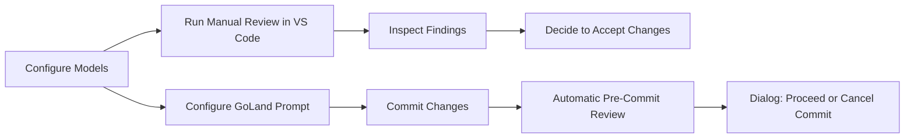

# Automatic Code Review Agent

The Automatic Code Review Agent delivers a shared review core with IDE-specific integrations for VS Code and GoLand. It automates diff-aware reviews using online or offline chat models while letting developers keep the final decision to accept or reject commits.

## Repository Structure

- `core/` – TypeScript service that loads configuration, gathers diffs, collects structural context, and orchestrates chat model executions.
- `vscode-extension/` – VS Code extension wrapping the core service with commands for configuring models and running reviews.
- `goland-plugin/` – JetBrains GoLand plugin that executes pre-commit reviews, displays findings, and defers the final commit decision to the user.

## System Architecture

```mermaid
flowchart LR
    subgraph IDE Integrations
        VSCode[VS Code Extension]
        GoLand[GoLand Plugin]
    end

    subgraph Core Service
        CLI[CLI & Config Manager]
        ReviewSvc[Review Service]
        ModelRunner[Model Runner]
        Context[Context Resolver]
    end

    GitRepo[(Git Repository)]
    Models[Chat Models (Online / Offline)]

    VSCode -->|Commands| CLI
    GoLand -->|CLI Invocation| CLI
    CLI --> ReviewSvc
    ReviewSvc --> Context
    ReviewSvc --> GitRepo
    ReviewSvc --> ModelRunner
    ModelRunner --> Models
    Context --> GitRepo
```

## Data Flow



## Call Graph Highlights



## User Use Cases (from Developer Perspective)



## Configuration & Usage

### Core Service

1. Install dependencies and build the TypeScript project:
   ```bash
   cd core
   npm install
   npm run build
   ```
2. Add chat models:
   ```bash
   node dist/cli.js add-model --id openai-gpt4 --name "OpenAI GPT-4" --kind online --endpoint https://api.example.com --api-key sk-...
   node dist/cli.js add-model --id local-ggml --name "Local GGML" --kind offline --executable /path/to/binary
   ```
3. Define prompts:
   ```bash
   node dist/cli.js add-prompt --id default --name "Standard" --system "You are a senior reviewer." --user "Review with focus on Go best practices."
   ```
4. Run reviews manually:
   ```bash
   node dist/cli.js review --range HEAD~1..HEAD
   ```

### VS Code Extension

1. From `vscode-extension`, install dependencies and build:
   ```bash
   npm install
   npm run build
   ```
2. Use the **ACR Agent: Configure Models** command to add or edit online/offline models through guided prompts.
3. Trigger **ACR Agent: Review Latest Commit** to review the most recent diff with the configured prompt. The results open in the *ACR Agent Review* output channel for the developer to inspect before accepting changes.

### GoLand Plugin

1. Build the plugin:
   ```bash
   ./gradlew buildPlugin
   ```
2. Install the generated ZIP via *Settings → Plugins → Install Plugin from Disk…*.
3. Configure *Settings → Tools → ACR Agent*:
   - Default review prompt.
   - Preferred model ID (overrides the active model in the shared config).
   - Path to `.acr-agent.config.json` for shared settings.
4. On commit, the plugin runs `acr-agent review --range HEAD --staged`. The review summary is shown in a confirmation dialog so the user can either proceed with or cancel the commit.

## Extensibility Notes

- **Model Providers**: Add new chat models by extending the `.acr-agent.config.json` through the CLI or IDE UI. The core automatically discovers active models.
- **Prompts**: Store multiple prompt templates and toggle them via CLI or environment variable `ACR_AGENT_MODEL` for per-run model selection.
- **Context Collection**: Adjust `additionalContextGlobs` in the config file to fine-tune supplementary files used when rendering prompts.

## Limitations & Next Steps

- The current implementation expects the core package to be built so `core/dist/cli.js` is available for IDE integrations.
- Real chat model invocation relies on either an HTTP endpoint or an executable that reads prompts from stdin and emits responses on stdout.
- Future work: richer parsing of review output, streaming logs back into IDE panels, and deeper integration with GoLand’s commit workflow for incremental feedback.
