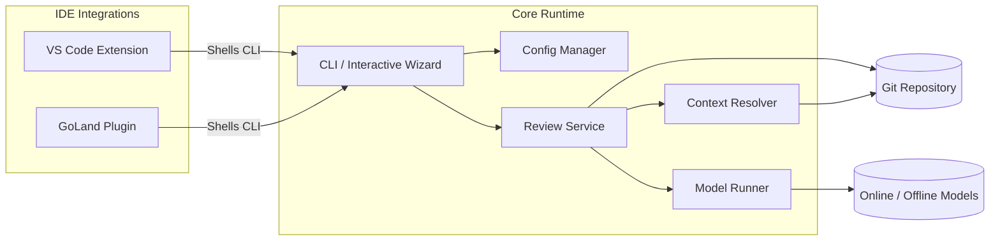
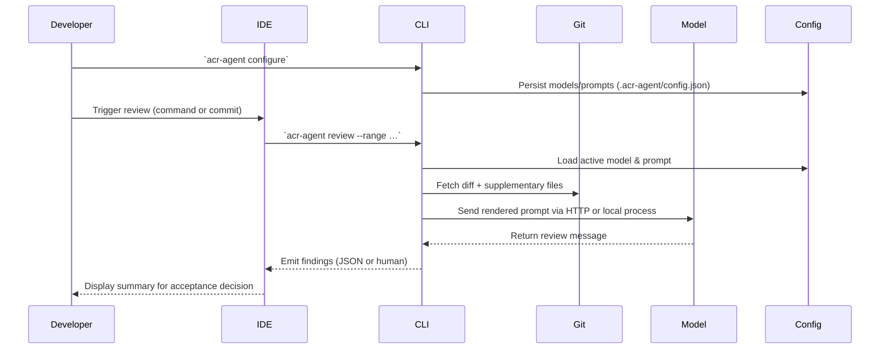
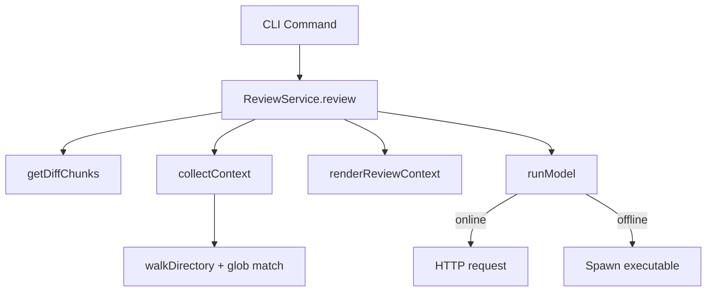
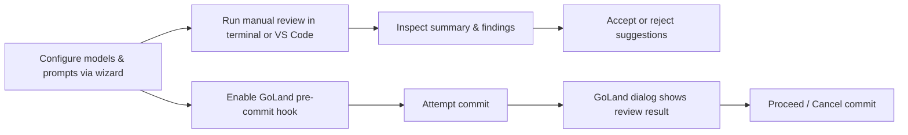

# Automatic Code Review Agent

The Automatic Code Review Agent packages a dependency-free Node.js core together with VS Code and GoLand integrations. It focuse
s on fast, deterministic configuration of online or offline chat models, commit-aware prompt rendering, and keeping developers i
n control of whether a suggested fix is accepted.

## Repository Structure

- `core/` – Lightweight ES module runtime that stores configuration, resolves git diffs, collects structural context, orchestrat
es chat model execution, and exposes an interactive CLI.
- `vscode-extension/` – VS Code extension that shells out to the shared CLI so reviews share the same configuration as the termi
nal workflow.
- `goland-plugin/` – JetBrains GoLand plugin that triggers the CLI as a before-commit check, surfaces the output, and lets the de
veloper decide if the commit proceeds.

## System Architecture



## Data Flow



## Call Graph Overview



## User Use Cases



## Core CLI Usage

The core no longer requires `npm install`; every module is implemented with Node.js built-ins. Run commands directly with `node c
ore/dist/cli.js …` or add `core/dist` to your `PATH`.

### Quick start

```bash
# Inspect help
node core/dist/cli.js help

# Launch the interactive wizard (recommended)
node core/dist/cli.js configure
```

Configuration is saved at `<workspace>/.acr-agent/config.json`. The wizard lets you:

1. Create or edit models (online/offline).
2. Manage prompt presets.
3. Switch the active model or prompt.
4. Adjust supplemental context glob patterns.

### Adding models without the wizard

Online model example:

```bash
node core/dist/cli.js add-model \
  --id openai \
  --name "OpenAI GPT-4" \
  --kind online \
  --endpoint https://api.openai.com/v1/chat/completions \
  --method POST \
  --body-template '{"messages":[{"role":"user","content":"{{prompt}}"}]}' \
  --response-path choices.0.message.content \
  --header 'Authorization=Bearer {{env:OPENAI_API_KEY}}'
```

Offline model example that writes the prompt to stdin:

```bash
node core/dist/cli.js add-model \
  --id local-llm \
  --name "Local LLM" \
  --kind offline \
  --command /opt/llm/bin/reviewer \
  --args "--temperature 0" \
  --prompt-template 'Review:\n{{prompt}}'
```

Optional flags for offline models:

| Flag | Description |
| --- | --- |
| `--prompt-mode argument` | Pass the prompt as a positional argument instead of stdin. |
| `--prompt-arg-index <n>` | Insert the prompt at a specific argument index. |
| `--env KEY=VALUE` | Provide additional environment variables (can be repeated). |

Headers for online models support `{{env:VAR}}` placeholders to pull secrets from the environment and `{{prompt}}` to inject the
rendered prompt anywhere in the payload.

### Prompts & review execution

```bash
# Create or update a prompt
node core/dist/cli.js add-prompt \
  --id secure \
  --name "Security Focus" \
  --system-prompt "You are a security-focused reviewer." \
  --user-prompt "Highlight security defects in the diff and recommend fixes."

# List configuration
node core/dist/cli.js list-models
node core/dist/cli.js list-prompts

# Run a review on staged changes and return JSON
node core/dist/cli.js review --range HEAD --staged --format json

# Override the active model or prompt for a single run
ACR_AGENT_MODEL=local-llm node core/dist/cli.js review --range HEAD~1..HEAD --prompt "Check for race conditions."
```

The review command prints either a human-readable summary or structured JSON (`--format json`). IDE integrations consume the JSON
format.

## VS Code Extension

1. From `vscode-extension`, run `npm install` and `npm run build`. (The extension depends on TypeScript tooling; these packages ma
y need to be mirrored in restricted environments.)
2. Use **ACR Agent: Configure Models** to invoke the shared wizard logic through VS Code prompts.
3. Trigger **ACR Agent: Review Latest Commit**; the extension calls the CLI with `--format json` and streams the findings into the
“ACR Agent Review” output channel.

## GoLand Plugin

1. Build with `./gradlew buildPlugin` and install the generated ZIP via *Settings → Plugins → Install Plugin from Disk…*.
2. Open *Settings → Tools → ACR Agent* to set:
   - Default prompt override (optional).
   - Preferred model ID (overrides the active model for GoLand reviews).
   - Path to `.acr-agent/config.json` so GoLand and VS Code share the same settings.
3. On commit, the plugin executes `acr-agent review --range HEAD --staged --format json` from the workspace. The JSON summary is d
isplayed in a confirmation dialog, letting you accept or cancel the commit.

## Configuration Details

The configuration file looks like this:

```json
{
  "activeModelId": "openai",
  "activePromptId": "default",
  "models": [
    {
      "id": "openai",
      "name": "OpenAI GPT-4",
      "kind": "online",
      "endpoint": "https://api.openai.com/v1/chat/completions",
      "method": "POST",
      "bodyTemplate": "{\"messages\":[{\"role\":\"user\",\"content\":\"{{prompt}}\"}]}",
      "responsePath": "choices.0.message.content",
      "headers": {
        "Authorization": "Bearer {{env:OPENAI_API_KEY}}"
      }
    },
    {
      "id": "local-llm",
      "name": "Local LLM",
      "kind": "offline",
      "command": "/opt/llm/bin/reviewer",
      "args": ["--temperature", "0"],
      "promptMode": "stdin",
      "promptTemplate": "Review:\n{{prompt}}"
    }
  ],
  "prompts": [
    {
      "id": "default",
      "name": "Balanced",
      "systemPrompt": "You are an expert reviewer. Identify bugs, risks, and missing tests.",
      "userPrompt": "Review the diff and provide clear, actionable feedback."
    }
  ],
  "additionalContextGlobs": ["**/*.go", "**/*.ts", "**/*.tsx", "**/*.py", "**/*.java"]
}
```

## Limitations & Next Steps

- The CLI relies on `git diff` output; repositories with custom diff drivers may require adjustments.
- Review parsing accepts Markdown or JSON responses. Adopting a strict JSON schema is recommended for complex automations.
- IDE integrations currently depend on the Node.js runtime being available on the system PATH.
- Future work: stream incremental findings into IDE panels, add richer diff visualisation, and provide first-class templates for
popular local models.
