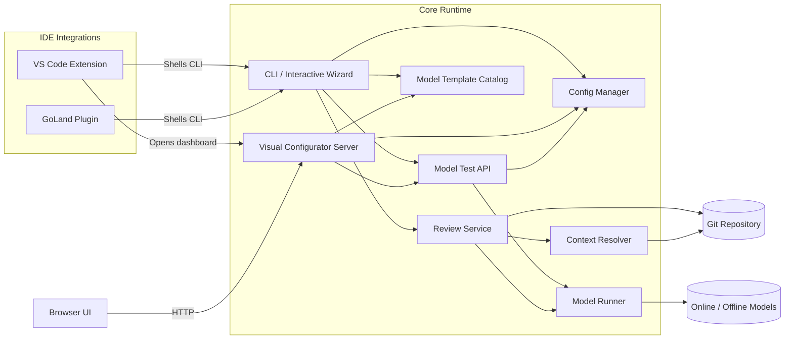
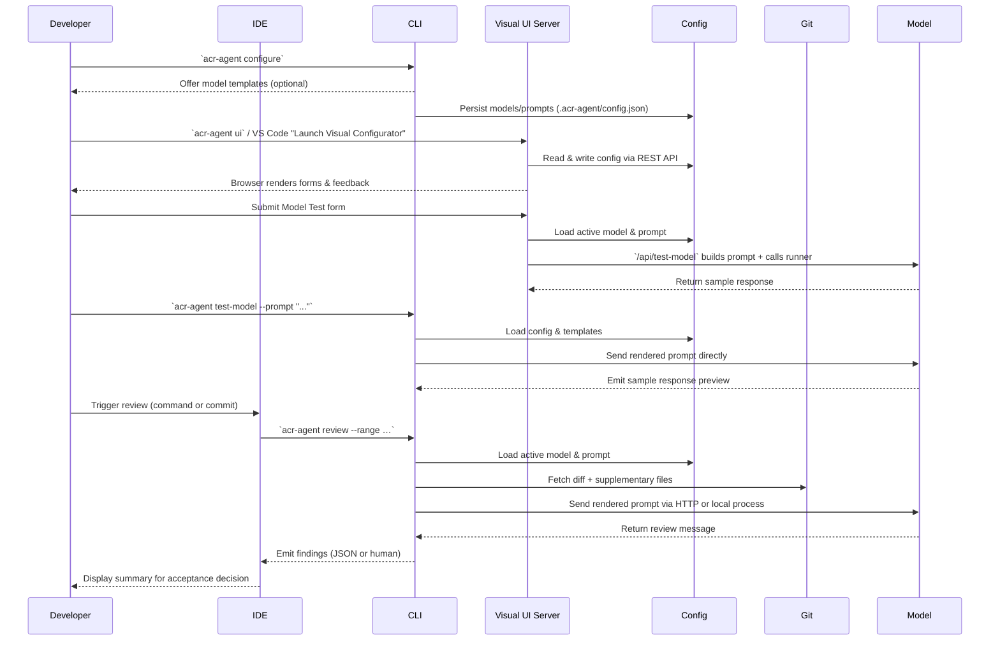
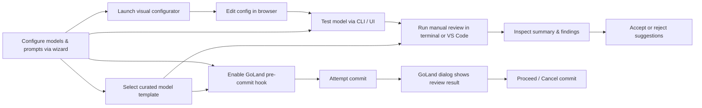
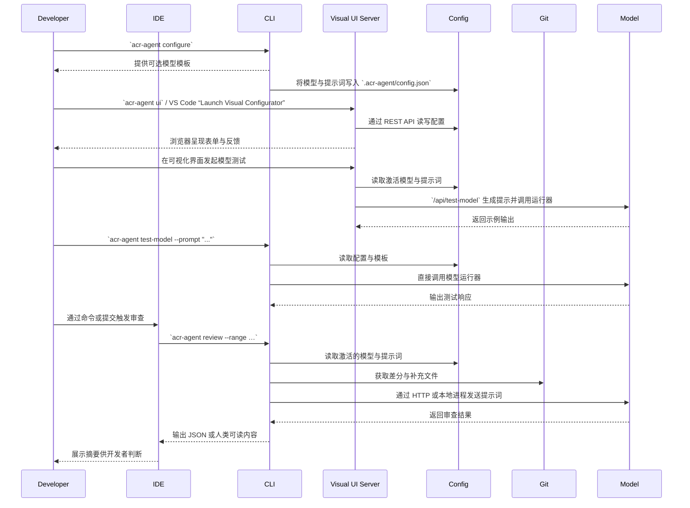

# Automatic Code Review Agent (English)

## Overview

Automatic Code Review Agent pairs a dependency-free Node.js core with VS Code and GoLand integrations. It emphasizes fast, deterministic configuration of online/offline chat models, commit-aware prompt rendering, and leaving the final decision to the developer. Curated model templates, a CLI wizard, and a visual dashboard keep the workflow approachable for both cloud and local reviewers.

### Feature Highlights

- **Unified configuration** – One `.acr-agent/config.json` drives the CLI, VS Code extension, and GoLand plugin.
- **Online & offline models** – HTTP chat APIs or local executables with stdin/argv prompt injection.
- **Commit-aware prompts** – Reviews run on diffs and pull in structural context files on demand.
- **Visual configurator** – Browser UI launched from the CLI or VS Code for form-based editing.
- **Template catalog** – Presets for popular HTTP and local runners accelerate onboarding.

## Repository Structure

- `core/` – Lightweight ES module runtime that stores configuration, resolves git diffs, collects structural context, orchestrates chat model execution, and exposes an interactive CLI.
- `vscode-extension/` – VS Code extension that shells out to the shared CLI so reviews share the same configuration as the terminal workflow.
- `goland-plugin/` – JetBrains GoLand plugin that triggers the CLI as a before-commit check, surfaces the output, and lets the developer decide if the commit proceeds.

## System Architecture



## Data Flow



## Call Graph Overview

```mermaid
graph TD
    CLICommand[CLI Command] --> ReviewEntry[ReviewService.review]
    CLICommand --> TemplateCatalog[chooseModelTemplate]
    CLICommand --> TestCommand[handleTestModel]
    ReviewEntry --> Diff[getDiffChunks]
    ReviewEntry --> Context[collectContext]
    ReviewEntry --> PromptBuilder[buildPromptFromConfig]
    PromptBuilder --> Prompt[renderReviewContext]
    ReviewEntry --> Runner[runModel]
    TestCommand --> PromptBuilder
    TestCommand --> Runner
    Runner -->|online| Fetch[HTTP request]
    Runner -->|offline| Process[Spawn executable]
    Context --> Glob[walkDirectory + glob match]
    UICommand[UI Server Command] --> VisualServer[startConfigUiServer]
    VisualServer --> RestHandlers[REST routes]
    RestHandlers --> ConfigManager
    RestHandlers --> TemplateCatalog
    RestHandlers --> TestRoute[/api/test-model]
    TestRoute --> PromptBuilder
    TestRoute --> Runner
    TestRoute --> ConfigManager
```

## User Use Cases



## Core CLI Usage

The core ships without external dependencies; every module relies on Node.js built-ins. Run commands directly with `node core/dist/cli.js …` or add `core/dist` to your `PATH`.

### Quick Start

```bash
# Inspect help
node core/dist/cli.js help

# Launch the interactive wizard (recommended)
node core/dist/cli.js configure
```

Configuration is saved at `<workspace>/.acr-agent/config.json`. The wizard lets you:

1. Create or edit models (online/offline).
2. Manage prompt presets.
3. Switch the active model or prompt.
4. Adjust supplemental context glob patterns.

### Adding Models without the Wizard

Online model example:

```bash
node core/dist/cli.js add-model \
  --id openai \
  --name "OpenAI GPT-4" \
  --kind online \
  --endpoint https://api.openai.com/v1/chat/completions \
  --method POST \
  --body-template '{"messages":[{"role":"user","content":"{{prompt}}"}]}' \
  --response-path choices.0.message.content \
  --header 'Authorization=Bearer {{env:OPENAI_API_KEY}}'
```

Offline model example that writes the prompt to stdin:

```bash
node core/dist/cli.js add-model \
  --id local-llm \
  --name "Local LLM" \
  --kind offline \
  --command /opt/llm/bin/reviewer \
  --args "--temperature 0" \
  --prompt-template 'Review:\n{{prompt}}'
```

Optional flags for offline models:

| Flag | Description |
| --- | --- |
| `--prompt-mode argument` | Pass the prompt as a positional argument instead of stdin. |
| `--prompt-arg-index <n>` | Insert the prompt at a specific argument index. |
| `--env KEY=VALUE` | Provide additional environment variables (can be repeated). |

Headers for online models support `{{env:VAR}}` placeholders to pull secrets from the environment and `{{prompt}}` to inject the rendered prompt anywhere in the payload.

### Model Templates

The interactive wizard and `add-model` CLI both surface curated templates so you can bootstrap configuration without memorizing every flag. Pass `--preset <id>` to `add-model` or pick a template when the wizard prompts you. The current catalog includes:

| Template id | Kind | Purpose | Defaults |
| --- | --- | --- | --- |
| `openai-chat` | Online | OpenAI Chat Completions API | HTTPS `POST` with bearer auth header and chat payload. |
| `generic-http` | Online | Minimal JSON API wrapper | `POST` body with `{"input":"{{prompt}}"}` and `output` response path. |
| `local-stdin` | Offline | Local executable reading stdin | Uses `./review.sh` placeholder, streams prompt via stdin. |
| `local-argument` | Offline | Local executable taking prompt argument | Injects prompt as final CLI argument with `./review.sh` placeholder. |

VS Code and GoLand reuse these templates by calling the shared CLI, so selections stay consistent across tools.

### Visual Configuration Dashboard

For teams that prefer a point-and-click workflow, launch the zero-dependency dashboard with either the CLI or the VS Code command palette:

```bash
# Start on port 4173 and automatically open the browser
node core/dist/cli.js ui --port 4173

# Run headlessly (useful for remote dev servers)
node core/dist/cli.js ui --host 0.0.0.0 --open=false

# Target a different repository without leaving your current shell
node core/dist/cli.js ui --repo ../payment-service --open=false
```

Once running, visit the printed URL to:

1. Create or edit models with form-based inputs and optional template application.
2. Switch active models/prompts and delete outdated entries.
3. Manage prompt personas with live previews.
4. Adjust context glob patterns via a multi-line editor.
5. Paste a diff snippet into **Model Test Console** to validate connectivity before running real reviews. The header shows which repository the server is bound to so you can confirm you are testing the right workspace.

VS Code exposes the same experience via **ACR Agent: Launch Visual Configurator**, which spawns the embedded server and opens your default browser. Stop the server at any time from the in-editor notification or with `Ctrl+C` in the terminal.

### Testing Models (CLI & UI)

Before wiring the agent into CI or IDE hooks, run a dry run to ensure the configured endpoint or local executable behaves as expected.

```bash
# Send an inline diff snippet to the active model
node core/dist/cli.js test-model --prompt "Ping" --diff "@@ file.go@@\n+fmt.Println(\"hello\")"

# Load a diff from disk and target another repository without changing directories
node core/dist/cli.js test-model --repo ../payment-service --diff-file /tmp/change.patch
```

The command prints the rendered prompt (so you can confirm templating) followed by the model’s response. Provide `--model <id>` to exercise a non-active configuration.

Prefer a visual confirmation? Open the dashboard via `acr-agent ui` or the VS Code command and scroll to **Model Test Console**. Select a model, paste a diff or plain text, and press **Run test**. The UI reuses the same prompt builder and runner as the CLI test command, so the response mirrors a real review.

### Prompts & Review Execution

```bash
# Create or update a prompt
node core/dist/cli.js add-prompt   --id secure   --name "Security Focus"   --system-prompt "You are a security-focused reviewer."   --user-prompt "Highlight security defects in the diff and recommend fixes."

# List configuration
node core/dist/cli.js list-models
node core/dist/cli.js list-prompts

# Run a review on staged changes and return JSON
node core/dist/cli.js review --range HEAD --staged --format json

# Override the active model or prompt for a single run
ACR_AGENT_MODEL=local-llm node core/dist/cli.js review --range HEAD~1..HEAD --prompt "Check for race conditions."

# Review a different repository without leaving your current terminal
node core/dist/cli.js review --repo ../data-plane --range main~1..main
```

The review command prints either a human-readable summary or structured JSON (`--format json`). IDE integrations consume the JSON format.

Pass `--repo <path>` to both `review` and `test-model` when you need to inspect another Git repository from a centralized workspace (for example, running reviews for multiple microservices from a monorepo of scripts).

## VS Code Extension

Use the shared CLI under the hood so every review path respects the same configuration, with a template-aware model configurator and visual dashboard shortcut.

1. From `vscode-extension`, run `npm install` and `npm run build`. (The extension depends on TypeScript tooling; these packages may need to be mirrored in restricted environments.)
2. Use **ACR Agent: Configure Models** to invoke the shared wizard logic through VS Code prompts, including a curated template picker for online and offline models. The command binds directly to the strongly typed `ChatModel` definition exported by the core runtime, so every saved model matches the schema consumed by the CLI and GoLand plugin.
3. Trigger **ACR Agent: Review Latest Commit**; the extension calls the CLI with `--format json` and streams the findings into the “ACR Agent Review” output channel.
4. Open whichever Git repository you want to review as the VS Code workspace. The extension shells out from the currently opened folder, so switching workspaces (or multi-root folders) lets you audit completely different repositories without reinstalling or reconfiguring the plugin. Use the CLI’s `--repo` flag when orchestrating reviews from scripts outside the IDE.

### Calling Configured Models

Once at least one model is configured, you can exercise it in two ways:

1. **VS Code command palette** – Run **ACR Agent: Review Latest Commit** (or bind it to a key) to execute the active model against `HEAD~1..HEAD`. Provide an optional ad-hoc prompt override when the command asks for it.
2. **Core CLI** – From the workspace root, call `node core/dist/cli.js review --range <commit-range>` (for example `HEAD~1..HEAD` or `HEAD --staged`). The CLI loads the same `.acr-agent/config.json`, selects the active model, and invokes the online/offline runner automatically.

In both cases the shared configuration and type-checked schema guarantee that any model configured inside VS Code is immediately runnable from the terminal workflow without manual edits.

## GoLand Plugin

Runs the CLI as a before-commit hook, surfaces the JSON review summary, and lets developers accept or cancel commits after inspecting findings.

1. Build with `./gradlew buildPlugin` and install the generated ZIP via *Settings → Plugins → Install Plugin from Disk…*.
2. Open *Settings → Tools → ACR Agent* to set:
   - Default prompt override (optional).
   - Preferred model ID (overrides the active model for GoLand reviews).
   - Path to `.acr-agent/config.json` so GoLand and VS Code share the same settings.
3. On commit, the plugin executes `acr-agent review --range HEAD --staged --format json` from the workspace. The JSON summary is displayed in a confirmation dialog, letting you accept or cancel the commit.

## Configuration Example

```json
{
  "activeModelId": "openai",
  "activePromptId": "default",
  "models": [
    {
      "id": "openai",
      "name": "OpenAI GPT-4",
      "kind": "online",
      "endpoint": "https://api.openai.com/v1/chat/completions",
      "method": "POST",
      "bodyTemplate": "{\"messages\":[{\"role\":\"user\",\"content\":\"{{prompt}}\"}]}",
      "responsePath": "choices.0.message.content",
      "headers": {
        "Authorization": "Bearer {{env:OPENAI_API_KEY}}"
      }
    },
    {
      "id": "local-llm",
      "name": "Local LLM",
      "kind": "offline",
      "command": "/opt/llm/bin/reviewer",
      "args": ["--temperature", "0"],
      "promptMode": "stdin",
      "promptTemplate": "Review:\n{{prompt}}"
    }
  ],
  "prompts": [
    {
      "id": "default",
      "name": "Balanced",
      "systemPrompt": "You are an expert reviewer. Identify bugs, risks, and missing tests.",
      "userPrompt": "Review the diff and provide clear, actionable feedback."
    }
  ],
  "additionalContextGlobs": ["**/*.go", "**/*.ts", "**/*.tsx", "**/*.py", "**/*.java"]
}
```

## Limitations & Next Steps

- The CLI relies on `git diff` output; repositories with custom diff drivers may require adjustments.
- Review parsing accepts Markdown or JSON responses. Adopting a strict JSON schema is recommended for complex automations.
- IDE integrations currently depend on the Node.js runtime being available on the system PATH.
- Future work: stream incremental findings into IDE panels, add richer diff visualisation, and provide first-class templates for popular local models.

---

# 自动化代码审查代理（中文）

## 项目概览

自动化代码审查代理由零依赖的 Node.js 核心与 VS Code、GoLand 插件组成，可快速配置在线或离线聊天模型，按提交差分渲染提示词，并始终让开发者自主决定是否采纳修改。项目内置精选模型模板、交互式 CLI 向导与可视化配置面板，兼顾云端与本地模型的体验。

### 功能亮点

- **统一配置**：同一份 `.acr-agent/config.json` 同时驱动 CLI、VS Code 扩展与 GoLand 插件。
- **支持在线与离线模型**：既可调用 HTTP 聊天接口，也可执行本地命令行程序并注入提示词。
- **感知提交的提示词**：先读取差分，再按需收集结构体或函数文件作为上下文。
- **可视化配置器**：可从 CLI 或 VS Code 启动浏览器界面，通过表单管理配置。
- **模板目录**：提供常见 HTTP / 本地执行器的预设，快速完成初始化。

## 仓库结构

- `core/` – 轻量级 ES 模块运行时，负责管理配置、解析 git diff、收集项目上下文、调度聊天模型并提供交互式 CLI。
- `vscode-extension/` – VS Code 扩展，通过共享 CLI 触发审查，确保 IDE 内外配置一致。
- `goland-plugin/` – GoLand 插件在提交前调用 CLI，展示结果，允许开发者选择是否继续提交。

## 系统架构


## 数据流



## 调用图概览

```mermaid
graph TD
    CLICommand[CLI Command] --> ReviewEntry[ReviewService.review]
    CLICommand --> TemplateCatalog[chooseModelTemplate]
    CLICommand --> TestCommand[handleTestModel]
    ReviewEntry --> Diff[getDiffChunks]
    ReviewEntry --> Context[collectContext]
    ReviewEntry --> PromptBuilder[buildPromptFromConfig]
    PromptBuilder --> Prompt[renderReviewContext]
    ReviewEntry --> Runner[runModel]
    TestCommand --> PromptBuilder
    TestCommand --> Runner
    Runner -->|online| Fetch[HTTP request]
    Runner -->|offline| Process[Spawn executable]
    Context --> Glob[walkDirectory + glob match]
    UICommand[UI Server Command] --> VisualServer[startConfigUiServer]
    VisualServer --> RestHandlers[REST routes]
    RestHandlers --> ConfigManager
    RestHandlers --> TemplateCatalog
    RestHandlers --> TestRoute[/api/test-model]
    TestRoute --> PromptBuilder
    TestRoute --> Runner
    TestRoute --> ConfigManager
```

## 用户视角用例


## 核心 CLI 用法

核心 CLI 没有额外依赖，仅使用 Node.js 内置模块，可直接通过 `node core/dist/cli.js …` 执行或将 `core/dist` 加入 `PATH`。

### 快速开始

```bash
node core/dist/cli.js help
node core/dist/cli.js configure
```

配置保存在 `<workspace>/.acr-agent/config.json`，向导可用于：

1. 创建或编辑在线 / 离线模型。
2. 管理提示词预设。
3. 切换当前使用的模型或提示词。
4. 调整补充上下文的 glob 模式。

### 直接添加模型

在线模型示例：

```bash
node core/dist/cli.js add-model \
  --id openai \
  --name "OpenAI GPT-4" \
  --kind online \
  --endpoint https://api.openai.com/v1/chat/completions \
  --method POST \
  --body-template '{"messages":[{"role":"user","content":"{{prompt}}"}]}' \
  --response-path choices.0.message.content \
  --header 'Authorization=Bearer {{env:OPENAI_API_KEY}}'
```

离线模型示例（stdin 提示）：

```bash
node core/dist/cli.js add-model \
  --id local-llm \
  --name "Local LLM" \
  --kind offline \
  --command /opt/llm/bin/reviewer \
  --args "--temperature 0" \
  --prompt-template 'Review:\n{{prompt}}'
```

离线模型可选参数：

| 参数 | 说明 |
| --- | --- |
| `--prompt-mode argument` | 将提示词作为位置参数传入而非 stdin。 |
| `--prompt-arg-index <n>` | 在指定参数位置插入提示词。 |
| `--env KEY=VALUE` | 额外的环境变量，可重复出现。 |

在线模型 Header 支持 `{{env:VAR}}` 读取环境变量，`{{prompt}}` 可在任意位置注入渲染后的提示词。

### 模型模板

CLI 向导与 `add-model` 命令都会展示模板，避免手动记忆所有参数。执行 `add-model --preset <id>` 或在向导中选择模板。目前包含：

| 模板 ID | 类型 | 适用场景 | 默认值 |
| --- | --- | --- | --- |
| `openai-chat` | 在线 | OpenAI Chat Completions API | 带 Bearer 认证头的 HTTPS `POST`。 |
| `generic-http` | 在线 | 通用 JSON API | `POST`，请求体为 `{"input":"{{prompt}}"}`，响应路径 `output`。 |
| `local-stdin` | 离线 | 从 stdin 读取提示词的本地程序 | 使用 `./review.sh` 示意，提示词通过 stdin 传入。 |
| `local-argument` | 离线 | 以参数接收提示词的本地程序 | 将提示词作为最后一个参数插入 `./review.sh`。 |

VS Code 与 GoLand 通过共享 CLI 复用这些模板，确保多端配置一致。

### 可视化配置面板

可使用 CLI 或 VS Code 命令面板启动无依赖的浏览器界面：

```bash
node core/dist/cli.js ui --port 4173
node core/dist/cli.js ui --host 0.0.0.0 --open=false

# 不切换目录直接操作其他仓库的配置
node core/dist/cli.js ui --repo ../payment-service --open=false
```

打开提示的地址即可：

1. 通过表单创建 / 编辑模型，可选套用模板。
2. 切换当前模型或提示词并删除旧配置。
3. 管理提示词人格并实时预览。
4. 在多行编辑器中维护补充上下文的 glob 列表。
5. 在 **Model Test Console** 粘贴 diff 或文本，先验证模型连通性再投入真实审查。页眉会标记服务器绑定的仓库路径，方便确认当前测试的是哪个工作区。

VS Code 提供 **ACR Agent: Launch Visual Configurator** 命令，可自动启动服务器并打开默认浏览器，可在通知或终端中随时停止。

### 模型测试（CLI / 可视化）

在接入 CI 或 IDE 之前，可以用快速测试命令确认在线 / 离线模型配置是否可用：

```bash
# 将内联 diff 发送到当前激活模型
node core/dist/cli.js test-model --prompt "Ping" --diff "@@ file.go@@\n+fmt.Println(\"hello\")"

# 指定其他仓库并从文件读取 diff
node core/dist/cli.js test-model --repo ../payment-service --diff-file /tmp/change.patch
```

命令会先打印渲染后的完整提示词，随后输出模型回复，便于确认模板变量与 HTTP / 本地命令是否生效。也可以通过 `--model <id>` 测试非激活模型。

若偏好可视化界面，可在控制台中打开 **Model Test Console**，选择模型、填写 diff 或普通文本，点击 **Run test** 即可。该面板与 CLI `test-model` 共享同一套 prompt 构建与运行逻辑，反馈内容与真实审查完全一致。

### 提示词与审查执行

```bash
node core/dist/cli.js add-prompt --id secure --name "Security Focus" --system-prompt "You are a security-focused reviewer." --user-prompt "Highlight security defects in the diff and recommend fixes."
node core/dist/cli.js list-models
node core/dist/cli.js list-prompts
node core/dist/cli.js review --range HEAD --staged --format json
ACR_AGENT_MODEL=local-llm node core/dist/cli.js review --range HEAD~1..HEAD --prompt "Check for race conditions."

# 不切换目录直接审查其他仓库
node core/dist/cli.js review --repo ../data-plane --range main~1..main
```

审查命令可输出可读文本或 JSON（`--format json`），IDE 插件默认读取 JSON。

`review` 与 `test-model` 均支持 `--repo <path>`，便于在脚本或自动化任务中指定任意 Git 仓库，无需逐个进入对应目录。

## VS Code 扩展

VS Code 扩展在内部复用 CLI，保证所有审查路径共享同一份配置，并提供支持模板的模型配置器和可视化面板入口。

1. 进入 `vscode-extension` 执行 `npm install`、`npm run build`。如网络受限，可自建 npm 镜像。
2. 执行 **ACR Agent: Configure Models** 触发 VS Code 提示链，直接调用核心定义的 `ChatModel` 类型，确保保存的模型与 CLI / GoLand 共用的 schema 完全一致。
3. 运行 **ACR Agent: Review Latest Commit**，扩展会以 `--format json` 调用 CLI，并将结果流式写入 “ACR Agent Review” 输出面板。
4. 将需要审查的 Git 仓库作为 VS Code 工作区打开。扩展始终在当前工作区目录下调用 CLI，因此切换工作区或使用多根目录即可审查不同项目；若在 IDE 外统一调度，可在 CLI 中使用 `--repo` 指定仓库路径。

### 调用已配置模型

当至少配置一个模型后，可以：

1. 在命令面板执行 **ACR Agent: Review Latest Commit**（可设置快捷键），默认针对 `HEAD~1..HEAD`，也可在提示中临时输入自定义提示词。
2. 在工作区根目录运行 `node core/dist/cli.js review --range <commit-range>`（如 `HEAD~1..HEAD` 或 `HEAD --staged`），CLI 会读取 `.acr-agent/config.json`，自动选择当前模型并执行 HTTP / 本地运行器。

统一配置与类型校验让 VS Code 中创建的模型无需额外修改即可在终端复用。

## GoLand 插件

GoLand 插件作为提交前检查执行 CLI，将 JSON 审查摘要展示在确认对话框中，开发者可在查看建议后决定是否继续提交。

1. 运行 `./gradlew buildPlugin` 并通过 *Settings → Plugins → Install Plugin from Disk…* 安装生成的 ZIP。
2. 在 *Settings → Tools → ACR Agent* 设置：
   - 默认提示词覆盖（可选）。
   - 指定模型 ID（覆盖激活模型，仅对 GoLand 审查生效）。
   - `.acr-agent/config.json` 路径，确保与 VS Code 共享配置。
3. 提交时插件会执行 `acr-agent review --range HEAD --staged --format json`，并在对话框内展示 JSON 摘要，允许继续或取消提交。

## 配置示例

```json
{
  "activeModelId": "openai",
  "activePromptId": "default",
  "models": [
    {
      "id": "openai",
      "name": "OpenAI GPT-4",
      "kind": "online",
      "endpoint": "https://api.openai.com/v1/chat/completions",
      "method": "POST",
      "bodyTemplate": "{\"messages\":[{\"role\":\"user\",\"content\":\"{{prompt}}\"}]}",
      "responsePath": "choices.0.message.content",
      "headers": {
        "Authorization": "Bearer {{env:OPENAI_API_KEY}}"
      }
    },
    {
      "id": "local-llm",
      "name": "Local LLM",
      "kind": "offline",
      "command": "/opt/llm/bin/reviewer",
      "args": ["--temperature", "0"],
      "promptMode": "stdin",
      "promptTemplate": "Review:\n{{prompt}}"
    }
  ],
  "prompts": [
    {
      "id": "default",
      "name": "Balanced",
      "systemPrompt": "You are an expert reviewer. Identify bugs, risks, and missing tests.",
      "userPrompt": "Review the diff and provide clear, actionable feedback."
    }
  ],
  "additionalContextGlobs": ["**/*.go", "**/*.ts", "**/*.tsx", "**/*.py", "**/*.java"]
}
```

## 限制与后续计划

- CLI 依赖 `git diff`，若仓库自定义 diff 驱动需要额外配置。
- 审查结果可解析 Markdown 或 JSON，复杂自动化流程建议统一采用严格 JSON 模板。
- 目前 IDE 集成需要系统 PATH 中存在 Node.js 运行时。
- 规划中的工作：在 IDE 面板中流式展示结果、增强 diff 可视化，并补充更多本地模型模板。
