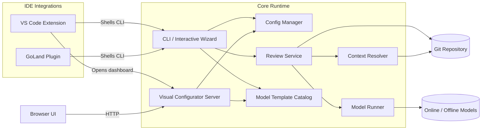
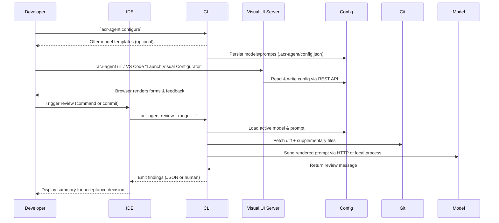
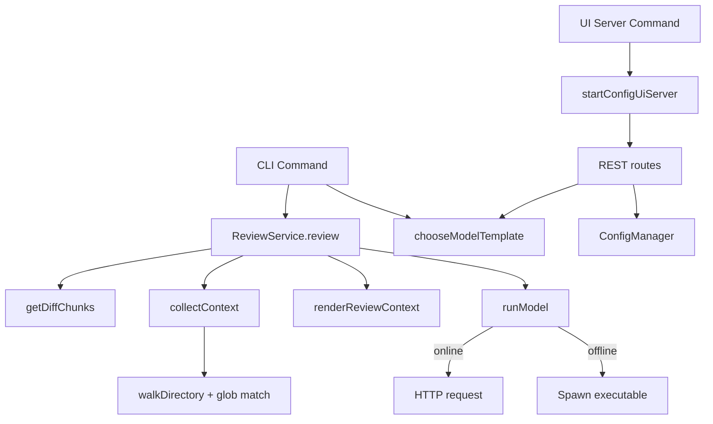
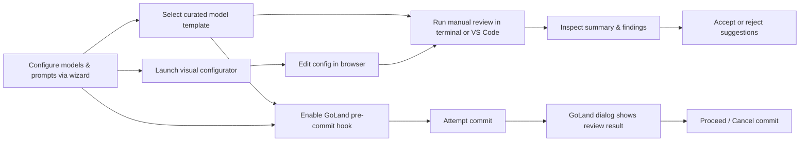

# Automatic Code Review Agent / 自动化代码审查代理

## Overview / 项目概览

**English** – Automatic Code Review Agent pairs a dependency-free Node.js core with VS Code and GoLand integrations. It emphasizes rapid, deterministic configuration of online/offline chat models, commit-aware prompt rendering, and letting developers decide whether to accept suggestions. Curated model templates, a CLI wizard, and a visual dashboard keep the workflow approachable for both cloud and local reviewers.

**中文** – Automatic Code Review Agent 由零依赖的 Node.js 核心与 VS Code、GoLand 插件组成，可快速配置在线或离线聊天模型，按提交差分渲染提示词，并始终让开发者自主决定是否采纳修改。项目内置精选模型模板、交互式 CLI 向导与可视化配置面板，兼顾云端与本地模型的体验。

### Feature Highlights / 功能亮点

- **Unified configuration / 统一配置** – One `.acr-agent/config.json` drives the CLI, VS Code extension, and GoLand plugin.
- **Online & offline models / 支持在线与离线模型** – HTTP chat APIs or local executables with stdin/argv prompt injection.
- **Commit-aware prompts / 感知提交的提示词** – Reviews run on diffs and pull in structural context files on demand.
- **Visual configurator / 可视化配置器** – Browser UI launched from the CLI or VS Code for form-based editing.
- **Template catalog / 模板目录** – Pre-baked presets for OpenAI-style APIs or local runners accelerate onboarding.

## Repository Structure / 仓库结构

- `core/` – Lightweight ES module runtime that stores configuration, resolves git diffs, collects structural context, orchestrates chat model execution, and exposes an interactive CLI.
  - `core/`（中文）– 轻量级 ES 模块运行时，负责管理配置、解析 git diff、收集项目上下文、调度聊天模型并提供交互式 CLI。
- `vscode-extension/` – VS Code extension that shells out to the shared CLI so reviews share the same configuration as the terminal workflow.
  - `vscode-extension/`（中文）– VS Code 扩展，通过 CLI 触发审查，确保与终端流程共享统一配置。
- `goland-plugin/` – JetBrains GoLand plugin that triggers the CLI as a before-commit check, surfaces the output, and lets the developer decide if the commit proceeds.
  - `goland-plugin/`（中文）– GoLand 插件在提交前调用 CLI，展示结果，允许开发者选择是否继续提交。

## System Architecture / 系统架构



## Data Flow / 数据流



## Call Graph Overview / 调用图概览



## User Use Cases / 用户视角用例



## Core CLI Usage / 核心 CLI 用法

**English** – The core ships without external dependencies; every module relies on Node.js built-ins. Run commands directly with `node core/dist/cli.js …` or add `core/dist` to your `PATH`.

**中文** – 核心 CLI 没有额外依赖，仅使用 Node.js 内置模块，可直接通过 `node core/dist/cli.js …` 执行或将 `core/dist` 加入 `PATH`。

### Quick start / 快速开始

```bash
# Inspect help
node core/dist/cli.js help

# Launch the interactive wizard (recommended)
node core/dist/cli.js configure
```

Configuration is saved at `<workspace>/.acr-agent/config.json`. The wizard lets you:

1. Create or edit models (online/offline).
2. Manage prompt presets.
3. Switch the active model or prompt.
4. Adjust supplemental context glob patterns.

**中文** – 配置保存在 `<workspace>/.acr-agent/config.json`。向导可用于：

1. 创建或编辑在线 / 离线模型。
2. 管理提示词预设。
3. 切换当前使用的模型或提示词。
4. 调整补充上下文的 glob 模式。

### Adding models without the wizard / 在 CLI 中添加模型

Online model example / 在线模型示例：

```bash
node core/dist/cli.js add-model \
  --id openai \
  --name "OpenAI GPT-4" \
  --kind online \
  --endpoint https://api.openai.com/v1/chat/completions \
  --method POST \
  --body-template '{"messages":[{"role":"user","content":"{{prompt}}"}]}' \
  --response-path choices.0.message.content \
  --header 'Authorization=Bearer {{env:OPENAI_API_KEY}}'
```

Offline model example that writes the prompt to stdin / 离线模型示例（stdin 提示）：

```bash
node core/dist/cli.js add-model \
  --id local-llm \
  --name "Local LLM" \
  --kind offline \
  --command /opt/llm/bin/reviewer \
  --args "--temperature 0" \
  --prompt-template 'Review:\n{{prompt}}'
```

Optional flags for offline models / 离线模型可选参数：

| Flag | Description |
| --- | --- |
| `--prompt-mode argument` | Pass the prompt as a positional argument instead of stdin. |
| `--prompt-arg-index <n>` | Insert the prompt at a specific argument index. |
| `--env KEY=VALUE` | Provide additional environment variables (can be repeated). |

Headers for online models support `{{env:VAR}}` placeholders to pull secrets from the environment and `{{prompt}}` to inject the rendered prompt anywhere in the payload.  
在线模型的 Header 可使用 `{{env:VAR}}` 从环境变量读取密钥，并通过 `{{prompt}}` 在任意位置注入渲染后的提示词。

### Model templates / 模型模板

The interactive wizard and `add-model` CLI both surface curated templates so you can bootstrap configuration without memorizing every flag. Pass `--preset <id>` to `add-model` or pick a template when the wizard prompts you. The current catalog includes:

| Template id | Kind | Purpose | Defaults |
| --- | --- | --- | --- |
| `openai-chat` | Online | OpenAI Chat Completions API | HTTPS `POST` with bearer auth header and chat payload. |
| `generic-http` | Online | Minimal JSON API wrapper | `POST` body with `{"input":"{{prompt}}"}` and `output` response path. |
| `local-stdin` | Offline | Local executable reading stdin | Uses `./review.sh` placeholder, streams prompt via stdin. |
| `local-argument` | Offline | Local executable taking prompt argument | Injects prompt as final CLI argument with `./review.sh` placeholder. |

Both the VS Code extension and GoLand plugin reuse these templates by calling into the shared CLI, so selections stay consistent across tools.  
VS Code 扩展与 GoLand 插件通过共享 CLI 复用这些模板，确保多端配置一致。

### Visual configuration dashboard / 可视化配置面板

For teams that prefer a point-and-click workflow, launch the zero-dependency dashboard with either the CLI or the VS Code command palette:

```bash
# Start on port 4173 and automatically open the browser
node core/dist/cli.js ui --port 4173

# Run headlessly (useful for remote dev servers)
node core/dist/cli.js ui --host 0.0.0.0 --open=false
```

Once running, visit the printed URL to:

1. Create or edit models with form-based inputs and optional template application.  
   通过表单创建/编辑模型，可选套用模板。
2. Switch active models/prompts and delete outdated entries.  
   切换当前模型或提示词并删除旧配置。
3. Manage prompt personas with live previews.  
   管理提示词人格并实时预览。
4. Adjust context glob patterns via a multi-line editor.  
   通过多行编辑器维护补充上下文的 glob 列表。

VS Code exposes the same experience via **ACR Agent: Launch Visual Configurator**, which spawns the embedded server and opens your default browser. Stop the server at any time from the in-editor notification or with `Ctrl+C` in the terminal.  
VS Code 通过 **ACR Agent: Launch Visual Configurator** 命令提供同样体验，可在通知或终端中停止服务。

### Prompts & review execution / 提示词与审查执行

```bash
# Create or update a prompt
node core/dist/cli.js add-prompt   --id secure   --name "Security Focus"   --system-prompt "You are a security-focused reviewer."   --user-prompt "Highlight security defects in the diff and recommend fixes."

# List configuration
node core/dist/cli.js list-models
node core/dist/cli.js list-prompts

# Run a review on staged changes and return JSON
node core/dist/cli.js review --range HEAD --staged --format json

# Override the active model or prompt for a single run
ACR_AGENT_MODEL=local-llm node core/dist/cli.js review --range HEAD~1..HEAD --prompt "Check for race conditions."
```

The review command prints either a human-readable summary or structured JSON (`--format json`). IDE integrations consume the JSON format.  
审查命令可输出可读文本或结构化 JSON（`--format json`），IDE 插件默认读取 JSON。

## VS Code Extension / VS Code 扩展

**English** – Use the shared CLI under the hood so every review path respects the same configuration, with a template-aware model configurator and visual dashboard shortcut.

**中文** – VS Code 扩展复用 CLI 能力，内置支持模板的模型配置器和可视化面板入口，让 IDE 内外的审查流程保持一致。

1. From `vscode-extension`, run `npm install` and `npm run build`. (The extension depends on TypeScript tooling; these packages may need to be mirrored in restricted environments.)
2. Use **ACR Agent: Configure Models** to invoke the shared wizard logic through VS Code prompts, including a curated template picker for online and offline models. The command binds directly to the strongly typed `ChatModel` definition exported by the core runtime, so every saved model matches the schema consumed by the CLI and GoLand plugin.
3. Trigger **ACR Agent: Review Latest Commit**; the extension calls the CLI with `--format json` and streams the findings into the “ACR Agent Review” output channel.

### Calling configured models / 调用已配置模型

Once at least one model is configured, you can exercise it in two ways:

1. **VS Code command palette** – Run **ACR Agent: Review Latest Commit** (or bind it to a key) to execute the active model against `HEAD~1..HEAD`. Provide an optional ad-hoc prompt override when the command asks for it.
2. **Core CLI** – From the workspace root, call `node core/dist/cli.js review --range <commit-range>` (for example `HEAD~1..HEAD` or `HEAD --staged`). The CLI loads the same `.acr-agent/config.json`, selects the active model, and invokes the online/offline runner automatically.

In both cases the shared configuration and type-checked schema guarantee that any model configured inside VS Code is immediately runnable from the terminal workflow without manual edits.  
无论使用哪种方式，统一配置与类型校验都确保在 VS Code 中创建的模型可以立即在终端 CLI 中调用。

## GoLand Plugin / GoLand 插件

**English** – Runs the CLI as a before-commit hook, surfaces the JSON review summary, and lets developers accept or cancel commits after inspecting findings.

**中文** – 以提交前钩子方式执行 CLI，将 JSON 审查摘要展示在确认对话框中，开发者可根据建议选择继续或取消提交。

1. Build with `./gradlew buildPlugin` and install the generated ZIP via *Settings → Plugins → Install Plugin from Disk…*.
2. Open *Settings → Tools → ACR Agent* to set:
   - Default prompt override (optional).
   - Preferred model ID (overrides the active model for GoLand reviews).
   - Path to `.acr-agent/config.json` so GoLand and VS Code share the same settings.
3. On commit, the plugin executes `acr-agent review --range HEAD --staged --format json` from the workspace. The JSON summary is displayed in a confirmation dialog, letting you accept or cancel the commit.

## Configuration Details / 配置示例

```json
{
  "activeModelId": "openai",
  "activePromptId": "default",
  "models": [
    {
      "id": "openai",
      "name": "OpenAI GPT-4",
      "kind": "online",
      "endpoint": "https://api.openai.com/v1/chat/completions",
      "method": "POST",
      "bodyTemplate": "{"messages":[{"role":"user","content":"{{prompt}}"}]}",
      "responsePath": "choices.0.message.content",
      "headers": {
        "Authorization": "Bearer {{env:OPENAI_API_KEY}}"
      }
    },
    {
      "id": "local-llm",
      "name": "Local LLM",
      "kind": "offline",
      "command": "/opt/llm/bin/reviewer",
      "args": ["--temperature", "0"],
      "promptMode": "stdin",
      "promptTemplate": "Review:
{{prompt}}"
    }
  ],
  "prompts": [
    {
      "id": "default",
      "name": "Balanced",
      "systemPrompt": "You are an expert reviewer. Identify bugs, risks, and missing tests.",
      "userPrompt": "Review the diff and provide clear, actionable feedback."
    }
  ],
  "additionalContextGlobs": ["**/*.go", "**/*.ts", "**/*.tsx", "**/*.py", "**/*.java"]
}
```

## Limitations & Next Steps / 限制与后续计划

- The CLI relies on `git diff` output; repositories with custom diff drivers may require adjustments.  
  CLI 依赖 `git diff`，若仓库自定义 diff 驱动需要额外配置。
- Review parsing accepts Markdown or JSON responses. Adopting a strict JSON schema is recommended for complex automations.  
  目前支持 Markdown 或 JSON，复杂自动化建议采用严格 JSON 模板。
- IDE integrations currently depend on the Node.js runtime being available on the system PATH.  
  IDE 集成需要系统 PATH 中存在 Node.js。
- Future work: stream incremental findings into IDE panels, add richer diff visualisation, and provide first-class templates for popular local models.  
  未来计划：IDE 内增量输出、增强 diff 可视化、补充更多本地模型模板。
